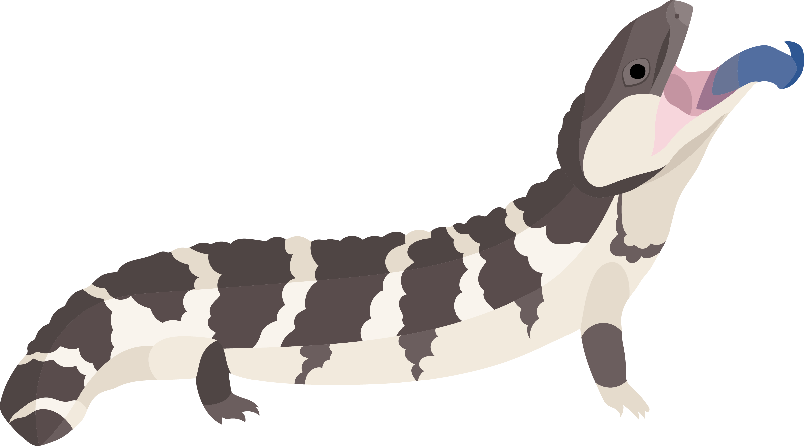

# Evolving Novel Morphotypes by Bursts
Documentation for *Morphological novelty evolves by bursts in a continental radiation of skinks*

This project focuses on the tempo and mode of evolution of novel morphologies by looking at the morphological evolution of Tiliquini skinks. This includes a phylogenomic estimate of species-level relationships for the group. If you're here, you've probably already read the paper.

<!--  -->

## Directories
A general guide to the directories and files contained in this repository.  
Each directory includes a summary of the associated files.  

---

### [Alignments]()
+ Individual, concatenated, and codon partitioned alignments. 

---

### [Data]()
+ Input raw and processed data files, and RData objects for recreating analyses. 

---

### [Figures]()
+ Main text figures, supplementary figures, animal illustrations, and components. 

---

## [Manuscript]()
+ All original and revised manuscript files

---

### [Scripts]()
+ Code for analyzing the data and generating figures

---

### [Trees]()
+ Resulting phylogenetic estimates. 

___

## [Walkthrough]()
+ A general walkthrough of the methods, data, and analyses. 

